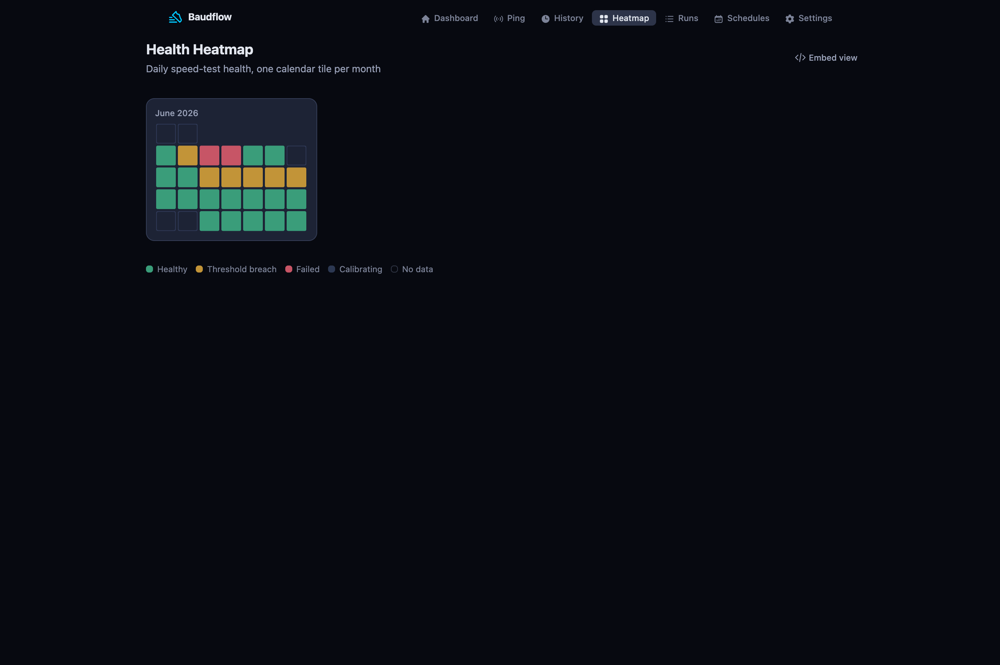

To monitor ISP speed is to measure what your connection actually delivers, on a
schedule, and keep the record so a slow evening can't be dismissed as anecdote.
baudflow runs an Ookla test from your line, stores every result in full, and
exposes the record through Prometheus metrics, an embeddable heatmap, and the
raw history.

Monitoring means measuring your own connection repeatedly over time and
comparing it to the speed you pay for. The goal is a record of your own line, not
an audit of a provider (Ookla's terms, and plain honesty, discourage implying
that). baudflow derives the views that make the record hold up: an uptime
percentage, breach streaks, and a calendar heatmap of every shortfall. Derivation
is just-in-time, so changing a threshold re-derives history instantly; nothing
is backfilled, and nothing leaves the database unless you ship it. Below is how
to read it out into the stack you already run.



## Scrape it into Prometheus

`GET /metrics` is hand-rolled Prometheus text. No dependency, no cache, plain
text, so scrapers skip the JSON and session/CSRF plugs. Point a job at it:

```yaml
# prometheus.yml
scrape_configs:
  - job_name: baudflow
    static_configs:
      - targets: ['baudflow:4000']
    metrics_path: /metrics
```

Eight gauges come back. Stale reads render as `NaN`, and `baudflow_health` is
omitted entirely when there's no verdict (calibrating, off, failed):

```text
baudflow_download_mbps       # latest Ookla download
baudflow_upload_mbps         # latest Ookla upload
baudflow_ping_latency_ms     # latest latency (TCP-connect)
baudflow_ping_jitter_ms      # latest jitter
baudflow_packet_loss         # latest packet loss
baudflow_health              # 1 healthy / 0 unhealthy (omitted if no verdict)
baudflow_measurements_total  # retained measurements
baudflow_uptime_percentage   # share of the window that was healthy
```

Graph them in Grafana or alert on them in Alertmanager like any other exporter.
The full exposition notes are in the [metrics reference](../../docs/prometheus-metrics/).

## Embed the heatmap

For a dashboard tile, `GET /heatmap/embed` serves a chrome-less,
current-month-only health heatmap. Drop it straight into a Home Assistant or
Grafana panel:

```html
<iframe src="https://baudflow.example.com/heatmap/embed"
        style="border:0;width:100%;height:320px">
</iframe>
<!-- chrome-less, current-month-only health heatmap -->
```

It's a read-only view over the same raw store as the metrics endpoint, so the
tile and your Grafana panels never disagree.

## The dimension throughput misses

Throughput is usually the last thing to move. Latency, jitter, and packet loss
degrade first; the call lags while the speed test reads full speed. baudflow
runs a continuous TCP-connect ping runner alongside the speed tests, so those
readings land in the same record and the same `/metrics`. It opens a TCP socket
and times the handshake, which means it needs **no `CAP_NET_RAW`**: no
privileged container, no capability grant. See the [ping docs](../../docs/ping/) for the
live per-sample console.

## Take it to your provider

- **Screenshot the heatmap**: the calendar of shortfalls, above, is the thing a support thread can't wave away.
- **Export the history chart**: download or upstream the series from the UI.
- **Scrape `/metrics` into Grafana** and share a panel: the underlying numbers are the raw retained results.

Because every test is stored in full with the server and provider it reached,
the evidence is auditable from the day you install. It is the difference
between "it feels slow" and a record.

## Next steps

- [Prometheus metrics](../../docs/prometheus-metrics/): the full exposition reference.
- [Ping monitoring](../../docs/ping/): the latency dimension throughput misses.
- [Internet speed SLA](../../docs/internet-speed-sla/): the share of tests that hit your promised speed.
