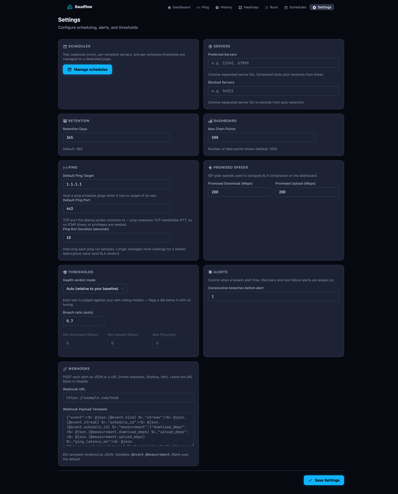

Almost everything is configured at runtime from the **Settings** page
(`/settings`) and the **Schedules** page (`/schedules`). There are no config
files to edit for normal operation.

## Settings

`Settings` is a typed key-value store. It holds strings and returns typed values
with a safe fallback (a bad value never crashes a queue), and every key ships
with a default. Read the full list in the
[Configuration reference](../configuration-reference/).



## Schedules

Scheduling is **data, not config keys**. Each schedule is a row that owns its
cron, its test type (Ookla speed test or TCP-connect ping), its server, its ping
target, and its own escalation state. The scheduler is a thin per-minute
dispatcher: it asks `Scheduling.due_now()` and enqueues whatever's due.

Run several at once (hourly against your ISP, every 15 minutes against
Cloudflare, a frequent ping) without touching a config file. See
[Schedules & adaptive cadence](../schedules/).

## Thresholds

What counts as "healthy" resolves as **per-schedule override → global `Settings`
fallback**, through a single reader (`Scheduling.thresholds_for/1`) so resolution
never yields `nil`. Three modes:

- **`auto`** (default): judges each test against the connection's own rolling
  baseline; zero-config.
- **`absolute`**: against fixed Mbps / ms values.
- **`off`**: no verdict.

Per-schedule thresholds are a tristate (Inherit / Enabled / Disabled). See
[Health & thresholds](../internet-speed-sla/).

## Servers

- **Preferred servers**: pin tests to specific Ookla server IDs.
- **Blocked servers**: exclude server IDs from selection.

Both are comma-separated lists, resolved through one reader.

## Notifications

Alerts are **behaviour implementations, not branches in a worker**. The worker
orchestrates a four-layer pipeline (event → policy → template → channel), and a
new channel is one module. `ntfy` and `webhook` ship out of the box. See
[Notifications](../notifications/).

## Ping target

A schedule may override the ping target and port per row; otherwise it falls back
to the global setting:

```elixir
schedule.target_host || Settings.get("ping_target")
schedule.target_port || Settings.get_integer("ping_port", 443)
```

The ping runner measures TCP-handshake RTT, so it works unprivileged with no
binary. See [Ping monitoring](../ping/).
