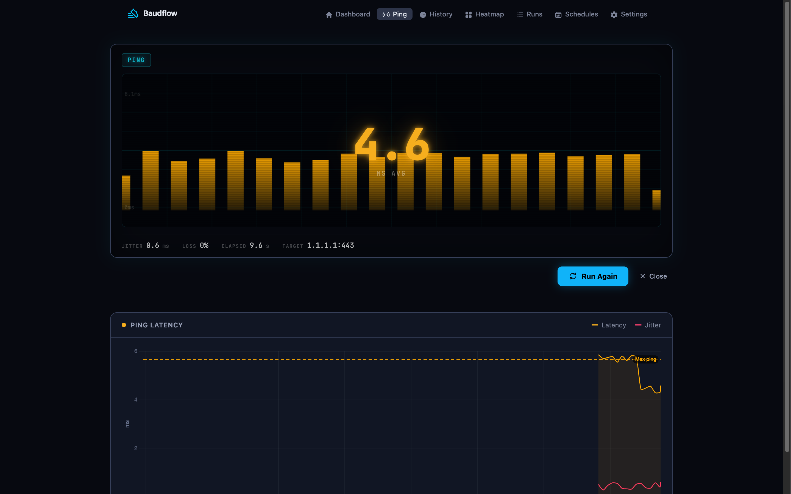

baudflow's ping monitor measures TCP-handshake RTT against a target, on its own
schedule, separate from speed tests so a test never perturbs it. The `/ping`
page streams each sample live into a diagnostics panel and keeps its own history
chart.

## Live diagnostics

Open the **Ping** page and run a test. The `PingViz` panel streams per-sample
progress over PubSub (`{:ping_progress, _}`): as each sample lands you watch the
cumulative average, jitter, low/high, and packet loss update in real time. When
the run finishes the panel freezes on the final readout until you dismiss it or
run again. You can also launch a ping from the main dashboard's split button,
which jumps to `/ping` and starts immediately.



## TCP-connect, not ICMP

The ping runner measures **TCP-handshake RTT**: it opens connections to
`host:port` at a fixed cadence (2 samples/second) for the configured duration and
treats each completed handshake (~1 RTT) as a latency sample, with failed
connects counted as packet loss. Sampling for a sustained window (default 10 s)
averages many readings into a stable value instead of a noisy burst.

This needs **no binary and no `CAP_NET_RAW`**: it works unprivileged under a
locked-down security context where neither the `ping` binary nor raw-socket
capabilities are available. The tradeoff is the price of entry: a target that
doesn't speak TCP on the configured port reads as 100% loss.

## Targets and ports

A schedule may override the target per row; otherwise the global setting applies:

```elixir
schedule.target_host || Settings.get("ping_target")        # 1.1.1.1
schedule.target_port || Settings.get_integer("ping_port", 443)
```

Defaults point at `1.1.1.1:443` (Cloudflare), which always accepts the
connection. Point a schedule at any host:port that speaks TCP.

## What a ping result carries

Latency, jitter, low, high, packet loss, and the full raw sample set. It
carries no download/upload, so [health](../internet-speed-sla/) skips those checks and judges
ping on latency alone.
