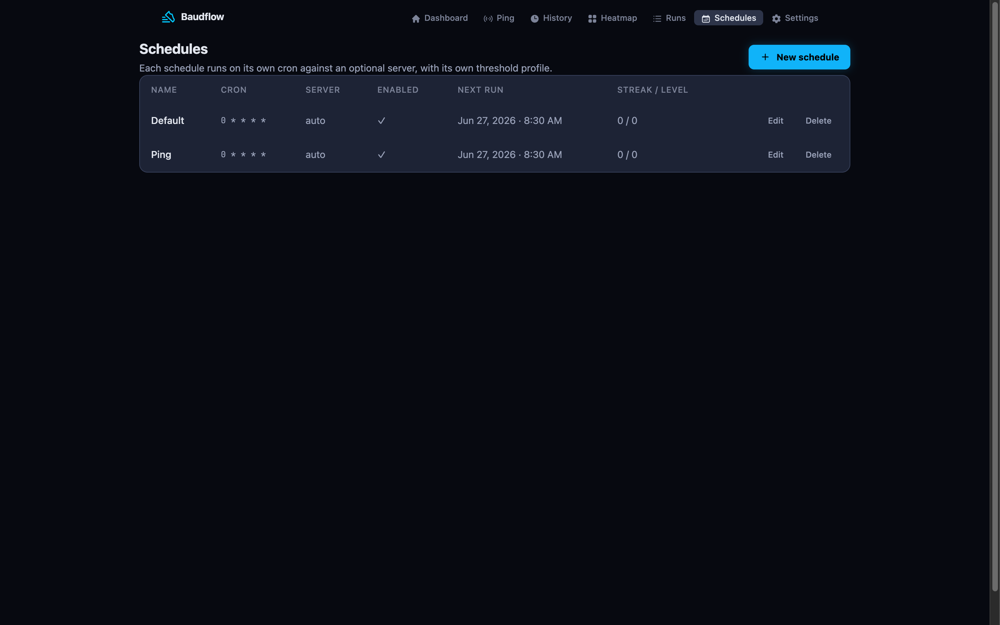

A schedule is a row: a cron cadence, a test type, a target, and its own escalation
and threshold state. Scheduling is **data, not config keys**, so the scheduler is
just a thin per-minute dispatcher: it asks `Scheduling.due_now()` and enqueues
whatever's due.

## Multiple schedules

Run as many as you like, each independent:

- an Ookla speed test every hour against your ISP's server,
- a speed test every 15 minutes against Cloudflare,
- a TCP-connect ping every minute against `1.1.1.1`.

A fresh install seeds two defaults (an hourly **Default** speed test and an hourly
**Ping** schedule), both escalating to every 15 minutes on a breach. Add or edit
them on the **Schedules** page (`/schedules`).

Each schedule owns:

| Field | Meaning |
|---|---|
| `cron` | Base cadence, e.g. `0 * * * *` (hourly). |
| `escalated_cron` | Faster cadence used while escalated. Blank = no speedup. |
| `test_type` | `ookla` (speed test) or `ping` (TCP-connect). |
| `server_id` | Pin an Ookla server (speed tests only). |
| `target_host` | Override the ping target for this schedule. |
| `enabled` | Disable without deleting. |
| `threshold_*` | Per-schedule threshold override (see [Health](../internet-speed-sla/)). |

A malformed cron is rejected at write time and, as a defensive belt, logged and
skipped at run time, so one bad row can't stall the per-minute queue.



## Adaptive cadence

This is baudflow's signature behavior: **when a schedule breaches, it runs faster
until it recovers**, capturing a granular outage timeline without spending
bandwidth the rest of the time.

Set an `escalated_cron` (the default is `*/15 * * * *`). When `HealthWorker`
detects a breach it bumps the schedule's `escalation_level`; the single reader
`Scheduling.active_cron/1` then returns the escalated cadence instead of the base
one. On recovery the level steps back down.

```
breach   → escalation_level++ → active_cron() returns escalated_cron
recover  → escalation_level-- → active_cron() returns cron (floored at 0)
```

The level is mutated with compare-and-set `update_all` (never get→change→update),
so concurrent jobs on the same row can't race. Without an `escalated_cron`, the
level is inert and the schedule always runs its base cadence.

## What stays decoupled

Cadence, escalation, and health are each owned by exactly one module: the schedule
row owns escalation state, `Scheduling` is the only thing that mutates it, and
`Health` is the only thing that computes a transition. Adaptive testing is a
switch in one reader, not a parallel code path.
